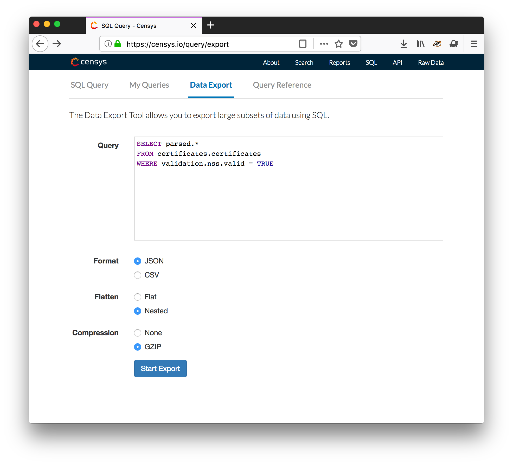

This collection of tools is designed to assemble a cascading
bloom filter containing all TLS certificate revocations, as described
in this [CRLite paper.](http://www.ccs.neu.edu/home/cbw/static/pdf/larisch-oakland17.pdf)

## Dependancies
1. A [Censys](https://censys.io) Researcher Account (for downloading certificates)
2. **About 3 terabytes of space to store certificates and associated data**
3. Node
4. Python
5. Lots of patience, as many of the scripts take several hours even with multiprocessing

## Instructions
### Part A: Obtaining all NSS-trusted Certificates
1. After obtaining a researcher account on [Censys](https://censys.io),
perform the following Data export query to collect all valid NSS-trusted certificates.
Be sure to request the results in JSON format, and select the "nested" option to
prevent collisions when flattening the data entries. The compression option is also
recommended (see screenshot below). **If you just want to try the tools on a small sample
subset of certificates (no Censys account required), use [this file](https://drive.google.com/open?id=0B_ImpEaqYaA8djd2NkxLNFdEdE0) instead and
skip to step 3.**

```
SELECT parsed.*
FROM certificates.certificates
WHERE validation.nss.valid = TRUE
```



2. Download the exported certificates, which will be provided in several hundred
files. The recommended method is to copy-paste the provided download URLs into
a file on your target machine, then use `wget -i URL_FILE` to download all
of the certificate files.

3. Unzip the certificate files and place their contents in a single, unified file.
Unzip with `gzip -u *.gz`, then unify the files with `cat *.json > certificates.json`.
You can then delete all files except for `certificates.json`. (If you're using
the sample file, then just unzip it and rename it as `certificates.json`).

### Part B: Determining CRL Revocations
0. Set `get_CRL_revocations` as the working directory. This folder contains all scripts for Part B.

1. Extract the CRL distribution points using the `extract_crls.py` script. This
script will output three files: a file of all certificates which have listed CRLs(`certs_using_crl.json`),
a file of all certificates which do not list a CRL(`certs_without_crl.json`),
and a list of all CRL distribution points (`CRL_servers`).

2. Sort and eliminate duplicate entries in `CRL_servers` using the command
`sort -u CRL_servers > CRL_servers_final`. You can compare your `CRL_servers_final`
to [my reference CRL list](https://drive.google.com/file/d/0B_ImpEaqYaA8MGRMSTh1cVJVdmM/view?usp=sharing)
to see that the replication results are similar up to this point.

3. Download all of the CRLs listed in `CRL_servers_final` using the command
`wget -i CRL_servers_final`.

4. Create a catalogue, or "megaCRL," of all revocations using the `build_megaCRL.py`
script. This will output `megaCRL`, which contains all revocation serial numbers
organized by CRL.

5. Use `count_serials.py` to see the total number of revocation serials that are
contained in the megaCRL. You can compare your results against mine by using the
same script on [my reference megaCRL file](https://drive.google.com/file/d/0B_ImpEaqYaA8Y0YxRzhsZ09UX0E/view?usp=sharing).

6. Match the revocation serial numbers to known certificates using the `build_CRL_revoked.py`
script. This script uses multiprocessing to get around the I/O bottleneck,
and you may need to adjust the number of "worker" processes to get optimal
speed on your machine. Each worker has a dedicated output file, so after the script you
will need to combine each output file into a single, final result using
`cat revokedCRLCerts/certs* > final_CRL_revoked.json`.

7. Count the number of actual revoked certificates using `wc -l final_CRL_revoked.json`.

### Part C: Determining OCSP Revocations
0. Set `get_OCSP_revocations` as the working directory. This folder contains all scripts for Part C.

1. Use the `build_OCSP_revoked.py` script to determine all Let's Encrypt revocations.
This tooling replicates the process of the CRLite authors, and I believe they made this
design choice to only include OCSP for Let's Encrypt based off the statistic that the
vast majority of OCSP-only certificates are issued by them. After the script completes,
combine the results of each worker into a final output file with
`cat OCSP_revoked/certs* > final_OCSP_revoked.json`.

### Part D: Building The Filter
0. Set `build_filter` as the working directory. This folder contains all scripts for Part D.

1. Use `build_final_sets.py` to convert the data created from the steps above into a single
set of all revoked certificates and all valid certificates. This script uses multiprocessing,
so after running the script you will need to use `cat final_unrevoked/*.json > final_unrevoked.json`
and `cat final_revoked/*.json > final_revoked.json` to combine the results of the individual
workers into a single file. You can see how your results match against mine by comparing
against [this file](https://drive.google.com/file/d/0B_ImpEaqYaA8eHVlTnJ4cW9lclk/view?usp=sharing).

2. Use the command `node --max_old_space_size=32768 build_filer.js > filter` to assemble
the final filter.
